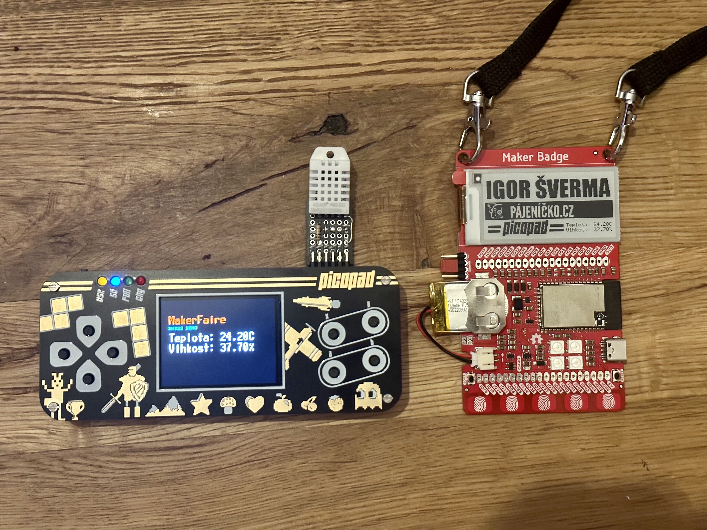

# Picopad + MakerBadge ♥
Picopad, equipped with the powerful RP2040 and programmed in MicroPython, is connected to the DHT22 sensor using an external connector. Every two seconds, Picopad reads data from the DHT22 and instantly displays it on its own display. MakerBadge (an Arduino project) plays the role of a sleeping hero. Once every 5 minutes, it wakes up and looks out for Picopad. Once it detects its presence, it quickly connects, retrieves the current temperature and humidity directly from Picopad, and displays it on its own display!

